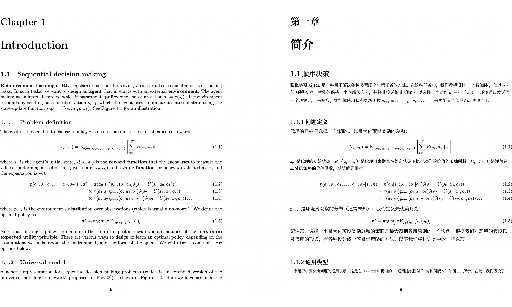

<!-- # Yet Another Document Translator -->

<div align="center">


<h2 id="title">Yet Another Document Translator</h2>

<p>
  <!-- PyPI -->
  <a href="https://pypi.org/project/yadt/">
    </a>
  <a href="https://pepy.tech/projects/yadt">
    </a>
  <!-- <a href="https://github.com/funstory-ai/yadt/pulls">
    </a> -->
  <!-- License -->
  <a href="./LICENSE">
    </a>
  <a href="https://t.me/+Z9_SgnxmsmA5NzBl">
    </a>
</p>
</div>

PDF scientific paper translation and bilingual comparison library.

- Provides a simple [command line interface](#getting-started).
- Provides a [Python API](#python-api).
- Mainly designed to be embedded into other programs, but can also be used directly for simple translation tasks.

## Preview

<div align="center">

</div>

## Getting Started

### Install from PyPI

We recommend using the Tool feature of [uv](https://github.com/astral-sh/uv) to install yadt.

1. First, you need to refer to [uv installation](https://github.com/astral-sh/uv#installation) to install uv and set up the `PATH` environment variable as prompted.

2. Use the following command to install yadt:

```bash
uv tool install --python 3.12 yadt

yadt --help
```

3. Use the `yadt` command. For example:

```bash
yadt --bing  --files example.pdf

# multiple files
yadt --bing  --files example1.pdf --files example2.pdf
```

### Install from Source

We still recommend using [uv](https://github.com/astral-sh/uv) to manage virtual environments.

1. First, you need to refer to [uv installation](https://github.com/astral-sh/uv#installation) to install uv and set up the `PATH` environment variable as prompted.

2. Use the following command to install yadt:

```bash
# clone the project
git clone https://github.com/funstory-ai/yadt

# enter the project directory
cd yadt

# install dependencies and run yadt
uv run yadt --help
```

3. Use the `uv run yadt` command. For example:

```bash
uv run yadt --bing --files example.pdf

# multiple files
uv run yadt --bing --files example.pdf --files example2.pdf
```

> [!TIP]
> The absolute path is recommended.

## Advanced Options

### Language Options

- `--lang-in`, `-li`: Source language code (default: en)
- `--lang-out`, `-lo`: Target language code (default: zh)

> [!TIP]
> Currently, this project mainly focuses on English-to-Chinese translation, and other scenarios have not been tested yet.

### PDF Processing Options

- `--files`: One or more file paths to input PDF documents.
- `--pages`, `-p`: Specify pages to translate (e.g., "1,2,1-,-3,3-5"). If not set, translate all pages
- `--split-short-lines`: Force split short lines into different paragraphs (may cause poor typesetting & bugs)
- `--short-line-split-factor`: Split threshold factor (default: 0.8). The actual threshold is the median length of all lines on the current page \* this factor

### Translation Service Options

- `--qps`: QPS (Queries Per Second) limit for translation service (default: 4)
- `--ignore-cache`: Ignore translation cache and force retranslation
- `--no-dual`: Do not output bilingual PDF files
- `--no-mono`: Do not output monolingual PDF files
- `--openai`: Use OpenAI for translation (default: False)
- `--bing`: Use Bing for translation (default: False)
- `--google`: Use Google Translate for translation (default: False)

> [!TIP]
>
> 1. You must specify one translation service among `--openai`, `--bing`, `--google`.
> 2. It is recommended to use models with strong compatibility with OpenAI, such as: `glm-4-flash`, `deepseek-chat`, etc.
> 3. Currently, it has not been optimized for traditional translation engines like Bing/Google, it is recommended to use LLMs.

### OpenAI Specific Options

- `--openai-model`: OpenAI model to use (default: gpt-4o-mini)
- `--openai-base-url`: Base URL for OpenAI API
- `--openai-api-key`: API key for OpenAI service

### Output Control

- `--output`, `-o`: Output directory for translated files. If not set, use same directory as input
- `--debug`, `-d`: Enable debug logging level and export detailed intermediate results in `~/.cache/yadt/working`.

### Configuration File

- `--config`, `-c`: Configuration file path. Use the TOML format.

Example Configuration:

```toml
[yadt]
debug = true
lang-in = "en-US"
lang-out = "zh-CN"
qps = 20
# this is a comment
# pages = 4
openai = true
openai-model = "SOME_ALSOME_MODEL"
openai-base-url = "https://example.example/v1"
openai-api-key = "[KEY]"
# All other options can also be set in the configuration file.
```

## Python API

You can refer to the example in [main.py](https://github.com/funstory-ai/yadt/blob/main/yadt/main.py) to use YADT's Python API.

Please note:

1. Make sure all font files described in `main.download_font_assets` exist

2. The current `TranslationConfig` does not fully validate input parameters, so you need to ensure the validity of input parameters

## Background

There are a lot projects and teams working on to make document editing and translating easier like:

- [mathpix](https://mathpix.com/)
- [Doc2X](https://doc2x.noedgeai.com/)
- [minerU](https://github.com/opendatalab/MinerU)
- [PDFMathTranslate](https://github.com/funstory-ai/yadt)

There are also some solutions to solve specific parts of the problem like:

- [layoutreader](https://github.com/microsoft/unilm/tree/master/layoutreader): the read order of the text block in a pdf
- [Surya](https://github.com/surya-is/surya): the structure of the pdf

This project hopes to promote a standard pipeline and interface to solve the problem.

In fact, there are two main stages of a PDF parser or translator:

- **Parsing**: A stage of parsing means to get the structure of the pdf such as text blocks, images, tables, etc.
- **Rendering**: A stage of rendering means to render the structure into a new pdf or other format.

For a service like mathpix, it will parse the pdf into a structure may be in a XML format, and then render them using a single column reader order as [layoutreader](https://github.com/microsoft/unilm/tree/master/layoutreader) does. The bad news is that the original structure lost.

Some people will use Adobe PDF Parser because it will generate a Word document and it keeps the original structure. But it is somewhat expensive.
And you know, a pdf or word document is not a good format for reading in mobile devices.

We offer an intermediate representation of the results from parser and can be rendered into a new pdf or other format. The pipeline is also a plugin-based system which everybody can add their new model, ocr, renderer, etc.

## Roadmap

- [ ] Add line support
- [ ] Add table support
- [ ] Add cross-page/cross-column paragraph support
- [ ] More advanced typesetting features
- [ ] Outline support
- [ ] ...

Our first 1.0 version goal is to finish a translation from [PDF Reference, Version 1.7](https://opensource.adobe.com/dc-acrobat-sdk-docs/pdfstandards/pdfreference1.7old.pdf) to the following language version:

- Simplified Chinese
- Traditional Chinese
- Japanese
- Spanish

And meet the following requirements:

- layout error less than 1%
- content loss less than 1%

## Known Issues

1. Parsing errors in the author and reference sections; they get merged into one paragraph after translation.
2. Lines are not supported.
3. Does not support drop caps.

## How to Contribute

We encourage you to contribute to YADT! Please check out the [CONTRIBUTING](https://github.com/funstory-ai/yadt/blob/main/docs/CONTRIBUTING.md) guide.

Everyone interacting in YADT and its sub-projects' codebases, issue trackers, chat rooms, and mailing lists is expected to follow the YADT [Code of Conduct](https://github.com/funstory-ai/yadt/blob/main/docs/CODE_OF_CONDUCT.md).

## Acknowledgements

- [PDFMathTranslate](https://github.com/Byaidu/PDFMathTranslate)
- [DocLayout-YOLO](https://github.com/opendatalab/DocLayout-YOLO)
- [pdfminer](https://github.com/pdfminer/pdfminer.six)
- [PyMuPDF](https://github.com/pymupdf/PyMuPDF)

<h2 id="star_hist">Star History</h2>

<a href="https://star-history.com/#funstory-ai/yadt&Date">
 <picture>
   <source media="(prefers-color-scheme: dark)" srcset="https://api.star-history.com/svg?repos=funstory-ai/yadt&type=Date&theme=dark" />
   <source media="(prefers-color-scheme: light)" srcset="https://api.star-history.com/svg?repos=funstory-ai/yadt&type=Date" />
   
 </picture>
</a>